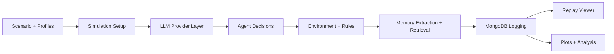

# Thesis Project 

A thesis project that studies commons governance with a local-first multi-agent simulation. Each run places 10 asymmetric agents into a shared pasture system, where 7 Herders extract resources, 2 Regulators monitor and sanction overuse, and 1 Scout reports ecological conditions. The project is built to compare how role asymmetry, memory, and model choice affect coordination, fairness, and sustainability over repeated rounds.

## Overview

This repository combines a simulation engine, provider-agnostic LLM routing, episodic memory retrieval, MongoDB-backed logging, and replay/analysis tooling in one workflow:

- The simulation engine handles rounds, roles, movement, grazing, sanctions, and shared-environment updates.
- The LLM layer lets the same simulation run on `ollama`, `openai`, `anthropic`, or `gemini`.
- The memory layer stores episodic traces and fact-like beliefs, then retrieves relevant beliefs for later rounds.
- MongoDB stores agent profiles, simulation logs, replay data, and persisted memory graphs.
- Analysis scripts generate ablation plots, cohort summaries, graph views, and memory visualizations after runs finish.



## Simulation Workflow

Each simulation round follows the same high-level loop:

1. The environment produces role-aware perception for each agent.
2. Each agent generates a private reflection.
3. The memory system retrieves relevant beliefs from prior rounds.
4. Each agent produces a public message and one discrete action.
5. The environment resolves movement, grazing, reports, sanctions, and council messaging.
6. New beliefs about the commons, agents, and outcomes are extracted and stored.
7. Metrics, replay snapshots, round logs, and memory graphs are written to MongoDB.

## Repository Structure

- `agent_flow/`: agent prompting, memory graph, retrieval, embeddings, parsing, fact extraction
- `config/`: settings, provider selection, MongoDB access, logger, cohorts, runtime setup
- `simulations/`: scenario configuration, rules, and narrative description
- `scripts/`: ablation runner, cohort analysis, plotting utilities
- `ui/`: replay viewer and rendering code
- `results/`: generated logs, plots, and graph outputs
- `tests/`: CLI, provider, replay, plotting, memory, and orchestration coverage

## Prerequisites

Before running the project, make sure you have:

- Python `3.10+`
- MongoDB available locally or through MongoDB Atlas
- `pip` for installing Python dependencies
- Ollama installed only if you want local-first inference with `ollama`

Commands in this README should be run from the repository root:

```bash
cd /path/to/simulations-project
```

## Step-by-Step Setup

### 1. Clone the repository

```bash
git clone https://github.com/smaswin21/simulations-project.git
cd simulations-project
```

### 2. Create and activate a virtual environment

```bash
python3 -m venv venv
source venv/bin/activate
```

### 3. Install dependencies

```bash
pip install -r requirements.txt
```

### 4. Create your local environment file

Copy the template and then fill in only the provider credentials you plan to use:

```bash
cp .env.example .env
```

The canonical environment contract for this repository lives in `.env.example`.

### 5. Prepare MongoDB

This project requires MongoDB for normal runs. Agent profiles are loaded from the `profiles` collection, and simulation logs, replay rounds, and memory graphs are stored back into MongoDB.

Choose one of the setup paths below:

#### Option A: Local MongoDB

1. Start MongoDB on your machine.
2. Put this in `.env`:

```bash
MONGODB_URI=mongodb://localhost:27017
```

#### Option B: MongoDB Atlas

1. Create or choose an Atlas cluster.
2. Create a database user and allow your IP to connect.
3. Put your Atlas connection string in `.env`:

```bash
MONGODB_URI=mongodb+srv://<username>:<password>@<cluster-url>/?retryWrites=true&w=majority
```

### 6. Seed the required profile data

The simulation expects profile documents in the MongoDB database `thesis-architecture`, collection `profiles`. This repository already includes a seed file at `EDA/cohort_personas.json`.

Run this once after setting `MONGODB_URI`:

```bash
python -c "from config.db import seed_from_json; print(seed_from_json('EDA/cohort_personas.json'))"
```

That command imports the bundled profile set into the `profiles` collection.

### 7. Optional: start Ollama for local inference

If you want to use the default local-first setup, make sure Ollama is running and a model is available:

```bash
ollama serve
ollama pull qwen3.5:9b
```

You can also use `llama3.2:1b` for quick smoke tests.

## Environment Variables

The project reads settings from `.env` through `python-dotenv`.

### Required for normal runs

- `MONGODB_URI`: required for loading profiles, writing simulation logs, and replaying runs later

### Provider selection

- `LLM_PROVIDER`: one of `ollama`, `openai`, `anthropic`, `gemini`
- `LLM_MODEL`: the model id for the selected provider

### Hosted provider credentials

- `OPENAI_API_KEY`: required when `LLM_PROVIDER=openai`
- `ANTHROPIC_API_KEY`: required when `LLM_PROVIDER=anthropic`
- `GEMINI_API_KEY`: required when `LLM_PROVIDER=gemini`

### Provider-specific optional settings

- `OPENAI_BASE_URL`: defaults to `https://api.openai.com/v1`
- `OPENAI_REASONING_EFFORT`: defaults to `low`
- `GEMINI_THINKING_LEVEL`: defaults to `low`
- `OLLAMA_API_BASE`: defaults to `http://localhost:11434/v1`
- `OLLAMA_BASE_URL`: alias for the Ollama-compatible OpenAI endpoint
- `OLLAMA_API_KEY`: defaults to `ollama`

### General generation settings

- `LLM_TEMPERATURE`
- `LLM_MAX_TOKENS`
- `MAX_CONCURRENT_AGENTS`

### Advanced memory and retrieval tuning

- `EMBEDDING_MODEL`
- `EMBEDDING_DIM`
- `RECENCY_DECAY`
- `RETRIEVAL_TOP_K`
- `BELIEF_ALIGNMENT_BOOST`
- `COSINE_CONTRADICT_THRESHOLD`
- `CONTRADICTION_BONUS`
- `EXPANSION_BONUS`
- `USE_LLM_CONTRADICTION`
- `USE_LAYER2_MEMORY`

## Provider Setup Guide

The simulation code is provider-agnostic, but hosted providers require their matching API key env var.

### Ollama

Use this for local inference with an OpenAI-compatible Ollama endpoint.

Example `.env` values:

```bash
LLM_PROVIDER=ollama
LLM_MODEL=qwen3.5:9b
OLLAMA_API_BASE=http://localhost:11434/v1
OLLAMA_BASE_URL=http://localhost:11434/v1
OLLAMA_API_KEY=ollama
```

Example run:

```bash
python run_simulation.py --ollama --model qwen3.5:9b --rounds 10 --seed 42
```

### OpenAI

Example `.env` values:

```bash
LLM_PROVIDER=openai
LLM_MODEL=gpt-5.4
OPENAI_API_KEY=<your-openai-key>
OPENAI_BASE_URL=https://api.openai.com/v1
OPENAI_REASONING_EFFORT=low
```

Example run:

```bash
python run_simulation.py --openai --model gpt-5.4 --rounds 10 --seed 42
```

### Anthropic

Example `.env` values:

```bash
LLM_PROVIDER=anthropic
LLM_MODEL=claude-3-5-sonnet-latest
ANTHROPIC_API_KEY=<your-anthropic-key>
```

Example run:

```bash
python run_simulation.py --anthropic --model claude-3-5-sonnet-latest --rounds 10 --seed 42
```

### Gemini

Example `.env` values:

```bash
LLM_PROVIDER=gemini
LLM_MODEL=gemini-3-flash-preview
GEMINI_API_KEY=<your-gemini-key>
GEMINI_THINKING_LEVEL=low
```

Example run:

```bash
python run_simulation.py --gemini --model gemini-3-flash-preview --rounds 10 --seed 42
```

## MongoDB Setup Details

The database name is fixed in code as:

```text
thesis-architecture
```

The main collections used by the project are:

- `profiles`: agent profiles loaded at simulation start
- `logs`: simulation metadata, round history, replay state, and final summaries
- `agent_memories`: per-agent persisted memory graphs

MongoDB is not optional for standard runs in the current codebase because:

- simulation setup loads profiles from MongoDB
- the logger creates a simulation document before the first round
- round-by-round replay data is read back from MongoDB by the Pygame viewer
- memory graphs are stored after rounds complete

## Running the Project

### Baseline run

This uses the configured provider and model from `.env`, or falls back to Ollama defaults when available:

```bash
python run_simulation.py
```

### Run a fixed number of rounds with a seed

```bash
python run_simulation.py --rounds 10 --seed 42
```

### Use Mongo-backed profile pool explicitly

```bash
python run_simulation.py --cohort-source mongo
```

### Run with a cohort file

```bash
python run_simulation.py --cohort-file EDA/similar_traits/cohort_similar_openness.json
```

### Hosted and local provider examples

```bash
python run_simulation.py --ollama --model qwen3.5:9b --rounds 10 --seed 42
python run_simulation.py --openai --model gpt-5.4 --rounds 10 --seed 42
python run_simulation.py --anthropic --model claude-3-5-sonnet-latest --rounds 10 --seed 42
python run_simulation.py --gemini --model gemini-3-flash-preview --rounds 10 --seed 42
```

### Run the ablation study

```bash
python -m scripts.run_ablation --runs 3 --rounds 10
```

### Plot ablation outputs

```bash
python -m scripts.plot_ablation
```

### Replay a stored simulation in Pygame

Each simulation prints a MongoDB-backed identifier like:

```text
Simulation ID: 507f1f77bcf86cd799439011
```

Use that id to replay the run:

```bash
python -m ui.pygame_app --simulation-id <SIMULATION_ID>
```

Optional replay flags:

```bash
python -m ui.pygame_app --simulation-id <SIMULATION_ID> --round-duration-ms 1000 --width 1200 --height 800
```

## Outputs and Artifacts

After successful runs, the main outputs appear in these places:

- MongoDB `logs` collection: simulation config, rounds, replay state, final summary
- MongoDB `agent_memories` collection: persisted memory graph snapshots
- `results/`: ablation JSONL files, analysis plots, graph outputs
- `memory_plots/`: auto-saved memory visualization images
- terminal output: selected provider, selected model, and the `Simulation ID`

## Testing

Run tests from the repository root:

```bash
PYTHONPATH=. pytest -q
```

For the documentation smoke check used during this update:

```bash
PYTHONPATH=. pytest -q tests/test_run_simulation_cli.py tests/test_llm_providers.py tests/test_db_replay_loader.py
```

## Troubleshooting

### `MONGODB_URI not found in .env`

The database layer requires `MONGODB_URI` before profile loading or logging can start. Copy `.env.example` to `.env` and set the connection string first.

### Hosted provider key errors

If you see errors mentioning `OPENAI_API_KEY`, `ANTHROPIC_API_KEY`, or `GEMINI_API_KEY`, make sure:

- `LLM_PROVIDER` matches the provider you intend to use
- the matching API key variable is set in `.env`
- `LLM_MODEL` is a valid hosted model id for that provider

### Ollama connection errors

If the project cannot reach Ollama:

- make sure Ollama is running
- verify the endpoint in `OLLAMA_API_BASE` or `OLLAMA_BASE_URL`
- confirm the model has been pulled locally
- switch explicitly to a hosted provider if you set hosted API keys but still left `LLM_PROVIDER` on `ollama`

### Import errors during tests or scripts

Run commands from the repository root. In environments where Python does not include the repo root automatically, use:

```bash
PYTHONPATH=. pytest -q
```

### Replay viewer cannot find a simulation

The replay viewer needs a valid MongoDB simulation id already stored in the `logs` collection. Use the exact `Simulation ID` printed by `python run_simulation.py`.

### Replay viewer says rounds or visualization state are missing

The viewer expects a completed run with stored round snapshots. Re-run the simulation and use the newly printed simulation id.
