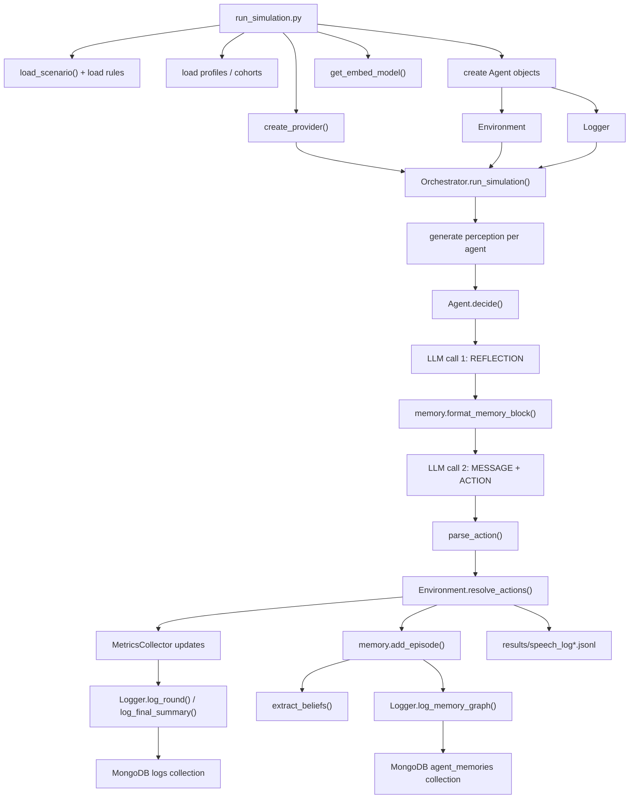
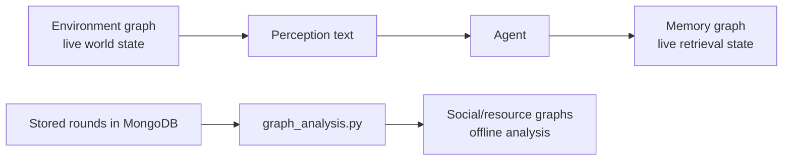
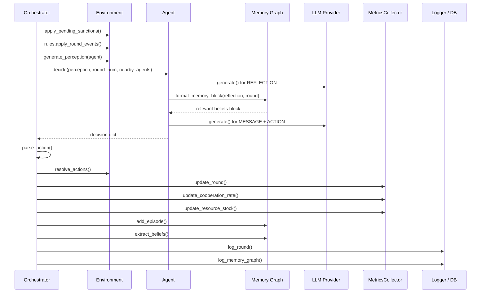
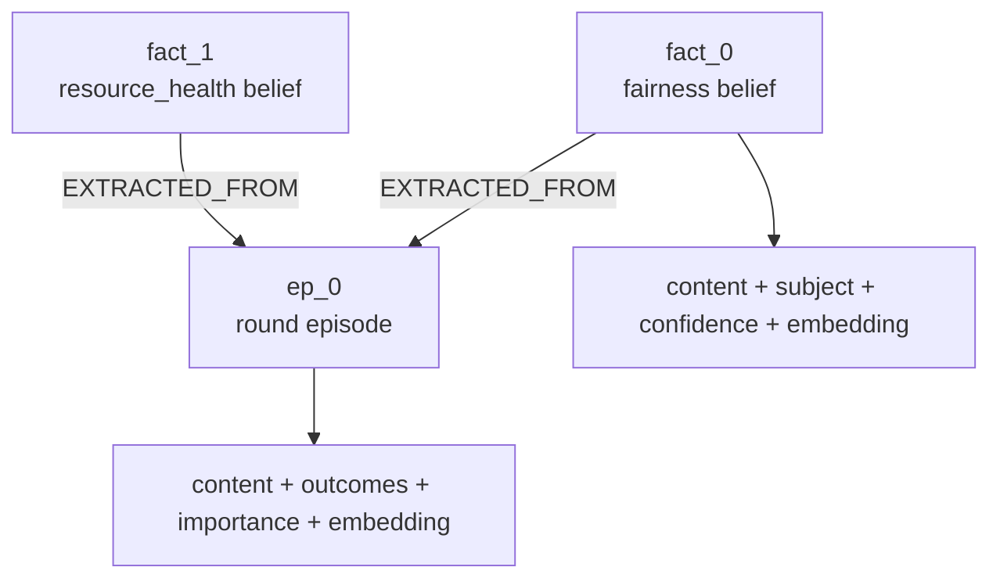
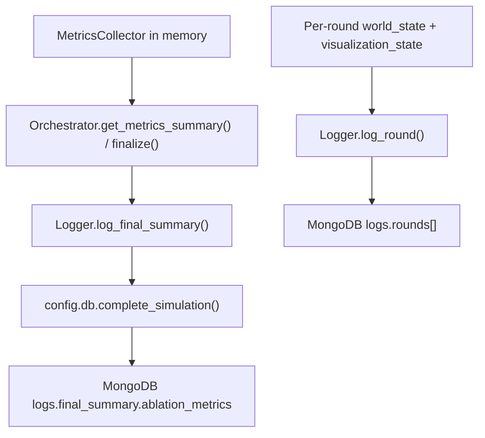

# Simulation Architecture Walkthrough

The walkthrough is grounded in the current implementation in:

- [`run_simulation.py`](../run_simulation.py)
- [`config/orchestrator.py`](../config/orchestrator.py)
- [`agent_flow/`](../agent_flow)
- [`metrics/`](../metrics)
- [`config/db.py`](../config/db.py)

## 1. High-Level Overview

At a high level, the project runs a repeated commons simulation with 10 role-asymmetric agents. Each round follows the same loop:

1. The environment generates a role-specific perception for each agent.
2. Each agent makes a private reflection with the LLM.
3. That reflection is used to retrieve relevant beliefs from the agent's own memory graph.
4. The agent makes a second LLM call to produce a public message and one discrete action.
5. The environment resolves movement, grazing, sanctions, and reports.
6. The orchestrator updates metrics, logs the round, and stores each agent's new episode and extracted beliefs.
7. MongoDB and local result files persist the run for analysis, plotting, and replay.

### Core Runtime Components

- [`run_simulation.py`](../run_simulation.py): bootstraps scenario, profiles, provider, agents, environment, logger, and orchestrator.
- [`config/orchestrator.py`](../config/orchestrator.py): owns the round loop and coordinates perception, decision, action resolution, memory writes, metrics, and persistence.
- [`agent_flow/agent.py`](../agent_flow/agent.py): implements the two-step `reflection -> retrieval -> message/action` agent policy.
- [`agent_flow/environment.py`](../agent_flow/environment.py): holds world state and resolves the consequences of actions.
- [`agent_flow/memory/`](../agent_flow/memory): stores per-agent episodic memory as a directed graph and performs retrieval.
- [`metrics/collector.py`](../metrics/collector.py): computes round-level and final run metrics.
- [`config/logger.py`](../config/logger.py) and [`config/db.py`](../config/db.py): persist runs and memory graphs to MongoDB.

### System Map



## 2. The Three Different Graphs in This Repository

The repo uses the word "graph" for three different things. They serve different purposes and should not be conflated.

| Graph type | Where it lives | What it represents | Used during live agent decisions? |
| --- | --- | --- | --- |
| Runtime world graph | [`agent_flow/environment.py`](../agent_flow/environment.py) | Agents, locations, and the commons depot | Yes |
| Per-agent episodic memory graph | [`agent_flow/memory/graph.py`](../agent_flow/memory/graph.py) and mixins | One agent's episodes and extracted beliefs | Yes |
| Post-hoc analysis graphs | [`results/graph_analysis.py`](../results/graph_analysis.py) | Social co-location and resource-flow graphs derived from stored rounds | No |

### 2.1 Runtime World Graph

[`Environment`](../agent_flow/environment.py) builds a `networkx.DiGraph()` that represents the current world state.

- Nodes include:
  - location nodes such as `Village Council` and `Pasture`
  - agent nodes with `resource` and `role`
  - a `resource_depot` node with the remaining commons stock
- Edges encode:
  - `agent -> location` with relation `LOCATED_AT`
  - `location -> agent` with relation `CONTAINS`

This graph is the environment's internal state model. Agents do not query it directly. Instead, the environment converts it into natural-language perceptions with `generate_perception()`.

### 2.2 Per-Agent Episodic Memory Graph

Each agent owns its own [`EpisodicMemoryGraph`](../agent_flow/memory/graph.py). This is also a `networkx.DiGraph()`, but it is separate from the world graph and separate from every other agent's memory.

- Episode nodes store:
  - round number
  - combined perception/reflection/message/action text
  - relevant outcomes
  - importance
  - embedding
- Fact nodes store:
  - belief content
  - category such as `fairness` or `resource_health`
  - subject
  - confidence
  - optional numeric value
  - source kind
  - embedding
- Edges currently store provenance only:
  - `fact -> episode` with `rel="EXTRACTED_FROM"`

This graph is the live retrieval substrate that shapes later agent decisions.

### 2.3 Post-Hoc Analysis Graphs

[`results/graph_analysis.py`](../results/graph_analysis.py) builds new graphs from stored round logs after the simulation has finished.

- `build_social_graph()` creates an undirected graph where edges count how often agents were co-located.
- `build_resource_graph()` creates a directed graph of resource claims from the depot and sanction flows between agents.

These graphs are analytic artifacts. They do not feed back into `Agent.decide()` and are not part of online retrieval.

### Visual Comparison



## 3. High-Level End-to-End Flow

The cleanest way to understand the project is to split it into bootstrapping, round execution, and persistence.

### 3.1 Bootstrapping

[`run_simulation.py`](../run_simulation.py) does the following:

- loads scenario config and scenario text with [`config/scenario_loader.py`](../config/scenario_loader.py)
- dynamically loads scenario-specific rules from `simulations/.../rules.py`
- loads agent profiles either from MongoDB `profiles` or a local cohort JSON via [`config/cohorts.py`](../config/cohorts.py)
- eagerly warms the embedding model with `get_embed_model()`
- creates one provider abstraction from [`config/llms/providers.py`](../config/llms/providers.py)
- assigns roles and builds each [`Agent`](../agent_flow/agent.py)
- creates the [`Environment`](../agent_flow/environment.py)
- creates a [`Logger`](../config/logger.py)
- creates the [`Orchestrator`](../config/orchestrator.py)
- runs `orch.run_simulation(num_rounds)`

### 3.2 Runtime Loop

For each round, [`Orchestrator.run_round()`](../config/orchestrator.py) is the control center:

- advance round state
- apply queued sanctions and scenario regeneration events
- generate perceptions
- gather asynchronous agent decisions
- parse actions
- resolve environment outcomes
- update metrics
- write speech logs
- store a new memory episode for each agent
- extract beliefs into the memory graph
- persist round data and memory graphs

### 3.3 Shutdown and Analysis

At the end of the run:

- the orchestrator finalizes metrics and writes a `final_summary` into MongoDB
- the logger stores the final summary in the `logs` collection
- memory graphs are left in `agent_memories`
- `run_simulation.py` optionally generates a memory-on plot in `memory_plots/`
- replay and analysis tools can later read the stored run

## 4. Deep Trace: Startup and Composition

### 4.1 Scenario Loading

[`config/scenario_loader.py`](../config/scenario_loader.py) loads `config.yaml`, optionally injects rendered scenario text from `scenario.md`, and normalizes a few shapes:

- `config["locations"]` is pulled from `world.locations`
- `config["resource"]` is normalized
- `config["scenario_text"]` is guaranteed to exist
- `config["events"]` is initialized to `[]`

That last detail matters for memory importance: in [`agent_flow/agent.py`](../agent_flow/agent.py), the agent tries to collect event rounds from `scenario["events"]`. Because the current scenario loader initializes that list as empty, agents fall back to the default event rounds defined in [`agent_flow/memory/graph.py`](../agent_flow/memory/graph.py): `{5, 8, 12, 15}`.

### 4.2 Provider Layer

[`config/llms/providers.py`](../config/llms/providers.py) hides provider-specific APIs behind one async interface:

- `OpenAIProvider`
- `AnthropicProvider`
- `GeminiProvider`
- `OllamaProvider`

All of them expose the same method:

```python
await provider.generate(system_prompt, user_prompt, max_tokens, temperature)
```

That means the rest of the simulation is provider-agnostic. `Agent.decide()` does not care which backend produced the text.

### 4.3 Agent Construction

Each agent is created with:

- a profile
- a role
- a persona prompt from [`agent_flow/persona_generator.py`](../agent_flow/persona_generator.py)
- a provider instance
- a per-agent memory graph

The persona prompt is built from:

- Big Five traits
- CRT score
- risk preference
- dependents
- scenario resource context
- role instructions

This prompt becomes the system prompt for both LLM calls inside `Agent.decide()`.

### 4.4 Environment Construction

[`Environment.__init__()`](../agent_flow/environment.py) creates the world graph and initializes:

- all agents at the starting location
- the resource depot stock
- speech logs by location
- pending sanctions
- cumulative harvest counters
- last scout report cache

This is also where stable agent ids and agent order for visualization are created.

## 5. Deep Trace: One Round in Exact Runtime Order

This section follows the exact order used in [`Orchestrator.run_round()`](../config/orchestrator.py).



### 5.1 Round Preparation

At the start of the round, the orchestrator:

- increments `env.round_number`
- snapshots `start_locations`
- applies sanctions due this round
- runs scenario rules such as commons regeneration
- stores round messages that should appear in perceptions

In the default tragedy-of-the-commons scenario, [`simulations/tragedy_of_commons/rules.py`](../simulations/tragedy_of_commons/rules.py) either:

- suspends regeneration if stock is at or below the collapse threshold, or
- regenerates the pasture by the configured amount

### 5.2 Perception Generation

[`Environment.generate_perception()`](../agent_flow/environment.py) converts the current world state into text. It includes:

- current round and act label
- scenario text on round 1
- current rule messages
- role-specific ecological information
- remembered scout report for non-scouts
- current location and who is nearby
- recent council speech
- personal inventory and cumulative harvest
- allowed action families

The role asymmetry is important:

- the Scout sees exact stock and regeneration
- Herders and Regulators see only qualitative ecological cues

### 5.3 Agent Decision Phase

Agents are decided concurrently with `asyncio.gather()` and a semaphore bounded by `MAX_CONCURRENT_AGENTS`.

For each agent:

1. The orchestrator computes `nearby_agents` from the current location.
2. [`Agent.decide()`](../agent_flow/agent.py) makes the first LLM call using:
   - system prompt: persona
   - user prompt: perception + reflection template
3. The agent extracts a single-line `REFLECTION:: ...`.
4. If `USE_LAYER2_MEMORY` is enabled, the agent calls `memory.format_memory_block(...)`.
5. The agent makes the second LLM call using:
   - perception
   - private reflection
   - retrieved beliefs block, if any
   - action template
6. The agent returns:
   - reflection
   - message
   - action text
   - raw model outputs
   - retrieved labels for logging

If an exception occurs inside the decision task, the orchestrator falls back to a safe `WAIT` action for that agent.

### 5.4 Action Parsing

[`agent_flow/action_parser.py`](../agent_flow/action_parser.py) converts raw `ACTION::` text into a structured action dict.

It validates role permissions:

- only Herders may graze
- only Regulators may sanction
- only the Scout may report

It also resolves sanction targets from the agents present at the same location.

### 5.5 Environment Resolution

[`Environment.resolve_actions()`](../agent_flow/environment.py) resolves actions in a fixed order:

1. moves
2. grazes
3. sanctions
4. scout reports
5. public messages

That ordering matters:

- location changes happen before grazing and later visibility checks
- sanctions are queued for the next round, not applied immediately
- reports and messages become public outcomes after movement/grazing resolution

One subtle but deliberate rule is that council messages are only logged as public speech if the agent started the round in `Village Council`. The method receives `start_locations` for exactly that purpose.

## 6. Agent Architecture: Reflection, Memory, and Action

The agent policy is not a single prompt. It is a two-stage architecture with a memory retrieval step in the middle.

### 6.1 Stage 1: Private Reflection

The first call asks the model to produce a compact internal belief summary:

- commons health
- trust and fairness
- role-specific concerns for this round

This reflection is not itself an action. It is a query-like intermediate state that the retrieval layer uses to decide what memories are relevant.

### 6.2 Stage 2: Memory-Conditioned Final Decision

If memory is enabled, the retrieved memory block is inserted between the reflection and the final action template. The second call then produces:

- `MESSAGE::`
- `ACTION::`

This architecture means retrieval is not based directly on the raw environment perception. It is based on the agent's own interpreted reflection of the situation.

## 7. Embeddings and Retrieval

This is the core retrieval architecture in the repository.

### 7.1 Shared Embedding Model

[`agent_flow/embedding.py`](../agent_flow/embedding.py) provides a process-wide singleton for embeddings.

- `get_embed_model()` lazily loads `fastembed.TextEmbedding`
- default embedding model is `BAAI/bge-small-en-v1.5`
- `embed_text(text)` returns a NumPy vector or `None`
- `cosine_similarity(a, b)` clamps similarity into `[0, 1]`
- `recency_score(current_round, node_round)` applies exponential decay

The embedding model is loaded once and then reused across all agents and all memory nodes.

### 7.2 Where Embeddings Are Stored

Embeddings are attached at node creation time:

- [`NodesMixin.add_episode()`](../agent_flow/memory/nodes.py) embeds the episode text
- [`NodesMixin.add_fact()`](../agent_flow/memory/nodes.py) embeds the fact text

So the memory graph is both:

- a symbolic structure with node/edge metadata, and
- a lightweight vector store in memory

There is no external vector database in this project. Retrieval operates directly over embeddings attached to the in-memory `networkx` graph.

### 7.3 Memory Graph Structure



Important implementation details:

- episode ids are `ep_<n>`
- fact ids are `fact_<n>`
- fact nodes point to their source episode
- there are currently no contradiction edges in the live graph

### 7.4 Retrieval Query

The retrieval query is the embedding of the current private reflection, not the full prompt and not the final action.

This happens in [`RetrievalMixin.retrieve_relevant()`](../agent_flow/memory/retrieval.py):

1. embed the current reflection
2. score all fact nodes
3. score all episode nodes
4. return top-ranked facts first
5. use at most one episode as fallback context

### 7.5 Retrieval Scoring Formula

For embedding-based retrieval, the code computes:

```text
score = cosine_similarity(query_vec, node_vec)
        * recency_score(current_round, node_round)
        * importance
```

Then it applies two multiplicative adjustments:

- belief-alignment boost: if similarity is at least `0.55`, multiply by `BELIEF_ALIGNMENT_BOOST`
- nearby-subject boost: if the node is a fact about an agent currently nearby, multiply by `1.25`

The importance term comes from:

- `episode["importance"]` for episode nodes
- `_source_episode_importance()` for fact nodes, derived from the parent episode

### 7.6 Importance Model

[`agent_flow/memory/scoring.py`](../agent_flow/memory/scoring.py) scores episode importance with simple rules:

- explicit event round: `1.0`
- round contains a report: `0.95`
- round contains a sanction: `0.9`
- round contains grazing: `0.8`
- round contains multiple messages: `0.6`
- otherwise: `0.3`

This is not a learned retriever. It is a heuristic importance layer stacked on top of embeddings.

### 7.7 Heuristic Fallback When Embeddings Are Unavailable

If FastEmbed is missing or the model fails to load, retrieval still works in heuristic mode.

Facts are scored with:

```text
W_CONF * confidence + W_REC * recency + W_IMP * importance
```

Episodes are scored similarly, except importance stands in for confidence.

This fallback path is important because it means memory is not all-or-nothing:

- memory storage still happens
- memory retrieval still happens
- only the semantic embedding layer is removed

### 7.8 Formatting Retrieved Context

[`FormattingMixin.format_memory_block()`](../agent_flow/memory/formatting.py) converts retrieved nodes into prompt text.

- if facts are found, it emits:
  - `RELEVANT BELIEFS:`
  - one line per fact with its category
- if no facts are found but an episode is available, it emits one compact episode summary

The returned `retrieved_labels` are only for logging and observability. The actual model sees the formatted text block.

### 7.9 Memory Ablation Behavior

[`scripts/run_ablation.py`](../scripts/run_ablation.py) toggles `cfg.USE_LAYER2_MEMORY`:

- condition `A`: memory retrieval disabled
- condition `B`: memory retrieval enabled

Crucially, "memory off" here means retrieval is disabled in [`Agent.decide()`](../agent_flow/agent.py). Storage and logging still continue:

- episodes are still written
- beliefs are still extracted
- memory graphs are still persisted

That matches the README statement that memory OFF disables retrieval only.

## 8. Belief Extraction and What Actually Gets Stored

After the environment resolves a round, each agent stores a new episode and then runs belief extraction over the outcomes relevant to that agent.

### 8.1 Episode Write Path

For each agent, the orchestrator builds an `episode_text` containing:

- the agent's perception
- the agent's private reflection
- the public message
- the chosen action text

Then it calls:

```python
episode_id = agent.memory.add_episode(...)
```

That episode becomes the anchor node for any facts extracted from the same round.

### 8.2 Fact Extraction Rules

[`agent_flow/fact_extractor.py`](../agent_flow/fact_extractor.py) currently extracts only two semantic categories:

- `fairness`
- `resource_health`

It does this from several sources:

- grazing outcomes
- sanction outcomes
- scout reports
- public messages
- inferred inventory disparities

Examples of stored beliefs:

- "`Ben took 2 units from the commons this round.`"
- "`Ben appears to be taking more than a fair share.`"
- "`Scout report indicates pasture health level 1.0.`"
- "`Holdings across the group look relatively balanced.`"

### 8.3 Message-Based Belief Extraction

For `message` outcomes, the extractor optionally uses the same LLM provider to return JSON of fairness beliefs only. If that LLM call fails or produces invalid JSON, it falls back to heuristics.

That means the project uses the LLM twice inside the round:

- directly for agent decisions
- indirectly for structured fairness-belief extraction from public speech

### 8.4 Provenance Edges

Facts are linked back to the episode that produced them with:

```text
fact_n --EXTRACTED_FROM--> ep_n
```

The tests in [`tests/test_memory_simplification.py`](../tests/test_memory_simplification.py) explicitly verify that the graph currently uses only episode provenance edges.

### 8.5 Serialization Behavior

[`EpisodicMemoryGraph.to_dict()`](../agent_flow/memory/graph.py) intentionally strips node embeddings before persistence:

- the graph structure and metadata are stored
- the raw vectors are replaced with `None`

When a graph is later reloaded through `from_dict()`, `re_embed_all()` rebuilds missing embeddings from node content.

This is an important design choice:

- live retrieval uses embeddings in memory
- persisted graphs store semantic content, not cached vectors

### 8.6 Code-vs-README Caveat

The README says the memory model includes contradiction edges. The current code does not implement that behavior in the active memory graph.

Evidence in the code:

- [`agent_flow/memory/nodes.py`](../agent_flow/memory/nodes.py) creates only nodes and `EXTRACTED_FROM` edges
- [`tests/test_memory_simplification.py`](../tests/test_memory_simplification.py) asserts exactly that
- contradiction-related config flags exist in [`config/config.py`](../config/config.py), but they are not wired into the current retrieval/write path

So the current implementation is a belief memory graph with provenance edges, not a contradiction-aware graph.

## 9. Metrics: What Is Measured, When It Is Updated, and Where It Is Stored

Metrics are collected in memory during the run and then persisted as part of the simulation record.

### 9.1 Runtime Metric Collection

[`MetricsCollector`](../metrics/collector.py) tracks:

- `gini_over_time`
- `accountability_over_time`
- `total_graze_over_time`
- `cooperation_rate_over_time`
- `resource_stock_over_time`
- `speech_diversity_over_time`
- `numeric_grounding_over_time`

The orchestrator updates metrics in this order after `Environment.resolve_actions()`:

1. `update_round(round_num, outcomes, inventories)`
2. `update_cooperation_rate(round_harvest_actions, sustainable_quota)`
3. `update_resource_stock(current_depot_stock)`

### 9.2 Metric Definitions

#### Gini

- computed from current agent inventories
- measures inequality of held resources

#### Accountability

- counts speech acts that both:
  - mention another agent by name
  - include an accountability-style verb such as `took`, `lied`, `hoarded`, or `sanctioned`

The collector stores both:

- raw accountability event counts
- final accountability rate = `accountability_events / total_speech_acts`

#### Total Graze

- sum of `amount` across round harvest actions

#### Cooperation Rate

- fraction of harvest actions whose amount is less than or equal to the scenario quota
- default quota comes from `commons.suggested_quota_per_agent`

#### Resource Stock

- current commons stock in the environment depot after round resolution

#### Speech Diversity

- `len(set(round_speeches)) / len(round_speeches)` for that round

#### Numeric Grounding

- fraction of round speech acts containing digits
- scout reports tend to increase this because they include exact numbers

### 9.3 Finalization

[`MetricsCollector.finalize()`](../metrics/collector.py) returns a summary dict containing:

- all over-time series
- final values such as `gini_final`, `resource_stock_final`, `cooperation_rate_final`
- aggregate totals such as `accountability_events` and `total_speech_acts`

The orchestrator includes that dict under `ablation_metrics` inside the final simulation summary.

### 9.4 Storage Path

The project does not use a dedicated `metrics` collection in MongoDB. Instead, metrics are embedded inside the simulation log document.



## 10. Persistence Model

### 10.1 MongoDB Database and Collections

[`config/db.py`](../config/db.py) connects to the MongoDB database:

- `thesis-architecture`

Primary collections:

- `profiles`
- `logs`
- `agent_memories`

### 10.2 What Goes into `logs`

`create_simulation()` inserts a document with:

- timestamp
- status
- config
- agent profiles
- empty `rounds`
- empty `final_summary`

Then:

- `append_round()` pushes round data into `rounds`
- `complete_simulation()` marks the run as completed and writes `final_summary`

Each round document includes:

- `round`
- `world_state`
- `visualization_state`
- `agent_actions`
- `outcomes`

The final summary includes:

- inventories
- final locations
- roles
- gini
- `ablation_metrics`

### 10.3 What Goes into `agent_memories`

`save_memory_graph()` upserts one document per `(simulation_id, agent_name)` pair. The collection has a compound unique index on those two fields.

Each document stores:

- `simulation_id`
- `agent_name`
- `graph_data`
- `episode_count`
- timestamps

`graph_data` is the serialized `EpisodicMemoryGraph.to_dict()` output, with embeddings removed.

### 10.4 Local File Outputs

Not everything is stored only in MongoDB.

Additional outputs:

- `results/speech_log*.jsonl`
  - public `message` and `report` outcomes per round
- `results/ablation_A*.jsonl` and `results/ablation_B*.jsonl`
  - one finalized metrics summary per ablation run
- `memory_plots/*.png`
  - memory-on run plots
- `results/analysis/*.png`
  - post-hoc graph visualizations

### 10.5 Replay and Plotting Read Paths

- [`ui/replay.py`](../ui/replay.py) loads `logs.rounds[]` via `db.get_simulation_rounds()`
- [`scripts/plot_memory_only.py`](../scripts/plot_memory_only.py) prefers `final_summary.ablation_metrics` and falls back to reconstructing stock/Gini from `rounds`
- [`results/graph_analysis.py`](../results/graph_analysis.py) loads a simulation document from MongoDB and builds analytic graphs from stored round data

## 11. What the Rest of the Repository Does

This is the rest of the repo, situated relative to the runtime architecture.

### `ui/`

The `ui` package is a replay layer, not part of live decision-making.

- [`ui/replay.py`](../ui/replay.py): loads stored visualization rounds from MongoDB
- [`ui/pygame_app.py`](../ui/pygame_app.py): launches the viewer
- [`ui/render.py`](../ui/render.py): draws HUD, agents, speech, and trails
- [`ui/world.py`](../ui/world.py): creates background maps and animated agent state

It consumes `visualization_state` generated by the environment and stored by the orchestrator.

### `scripts/`

The `scripts` folder is for experiments and post-processing.

- [`scripts/run_ablation.py`](../scripts/run_ablation.py): toggles memory OFF vs ON
- [`scripts/plot_ablation.py`](../scripts/plot_ablation.py): aggregates and plots ablation results
- [`scripts/plot_memory_only.py`](../scripts/plot_memory_only.py): plots one stored run
- [`scripts/analyze_cohorts.py`](../scripts/analyze_cohorts.py): summarizes cohort experiments

### `tests/`

The tests are useful architecture anchors because they show intended behavior.

Examples:

- [`tests/test_memory_simplification.py`](../tests/test_memory_simplification.py)
  - memory graph edge shape
  - belief extraction scope
  - nearby-subject retrieval boosts
- [`tests/test_round_flow_fixes.py`](../tests/test_round_flow_fixes.py)
  - stable public message location
  - report event locations
- [`tests/test_visualization_state.py`](../tests/test_visualization_state.py)
  - expected visualization snapshot fields
- [`tests/test_db_replay_loader.py`](../tests/test_db_replay_loader.py)
  - Mongo replay loading behavior
- [`tests/test_plot_memory_only.py`](../tests/test_plot_memory_only.py)
  - metric readback and reconstruction behavior
- [`tests/test_llm_providers.py`](../tests/test_llm_providers.py)
  - provider-specific request behavior

### `EDA/`

`EDA/` holds cohort and exploratory analysis assets. It is input and analysis material, not runtime simulation logic.

## 12. Key Takeaways

- The live architecture is centered on `run_simulation.py -> Orchestrator -> Agent + Environment + Memory + Logger`.
- There are two live graph systems:
  - the world graph in the environment
  - one memory graph per agent
- Embeddings are used only inside the agent memory layer, not in the environment and not in MongoDB queries.
- Retrieval is reflection-conditioned: the agent first interprets the round, then uses that internal reflection to search memory.
- Metrics are collected in memory during the run and stored inside MongoDB simulation logs, with raw rounds preserved for replay and reconstruction.
- The current memory implementation is simpler than the README implies: it stores episodes and facts with provenance edges, but not contradiction edges.
